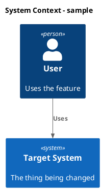

# Kanban Task Workflow

Use this skill to turn markdown task files into the active work queue for the repository. The task folder tree is the coordination surface: read it before acting, select one task at a time, move only the selected task file when changing status, update only the selected task file unless the user explicitly asks for broader edits, and keep code changes aligned with the task's current folder.

## Board Model

The default task root is `docs/kanban/`. Status is represented by the folder containing a task file. Folder names use a zero-padded order prefix plus a PascalCase status name. Do not use a text `status` property inside task files as the source of truth.

Create these folders if they are missing:

- `docs/kanban/01_Backlog/`
- `docs/kanban/02_Started/`
- `docs/kanban/03_Planning/`
- `docs/kanban/04_Ready/`
- `docs/kanban/05_ToDo/`
- `docs/kanban/06_InProgress/`
- `docs/kanban/07_Completed/`

Known folders:

- `01_Backlog`: user-managed. Stores ideas or tasks that are not ready for processing. Do not modify, plan, or implement these unless the user explicitly names one or asks to pull from `01_Backlog`. The user manually moves tasks from `01_Backlog` to `02_Started` to state that they are ready for planning.
- `02_Started`: handoff folder, agent-managed. Tasks here are ready to plan. When selecting a task from `02_Started`, move the selected task file to `03_Planning` before researching and planning it.
- `03_Planning`: agent-managed. Tasks need codebase research and an implementation plan before they can be reviewed by the user.
- `04_Ready`: user-managed. The user reviews the plan. If accepted, the user moves the task to `05_ToDo`. If the plan needs more work, the user adds comments and moves the task back to `03_Planning`.
- `05_ToDo`: handoff folder, agent-managed. Tasks are ready to implement. Move the selected task to `06_InProgress` before editing code.
- `06_InProgress`: agent-managed. Tasks are actively being implemented. Update implementation notes and checklist state in the task file.
- `07_Completed`: agent-managed. Completed tasks. Do not reopen unless the user asks or current verification proves the task is incomplete.

If the task root uses extra folders, preserve them and infer their meaning from local text before acting. Prefer the known folders above for automated workflow decisions.

## Task Files

Each task lives in its own markdown file so separate agents can work concurrently without rewriting a shared board file. Keep filenames stable unless renaming is necessary for clarity. Use a short, filesystem-safe filename that matches the task title when creating a new task.

Each task file should contain a task title, useful properties, a checklist, and notes. Use only properties that help the workflow. Do not invent due dates, labels, or estimates when the task does not need them.

Preferred shape:

```markdown
# Task title

- goal: Implement the scoped change, verified by focused tests, while preserving existing public behavior outside the task boundary.
- updated: 2026-06-29
- steps:
    - [ ] Research current behavior
    - [ ] Implement scoped change
    - [ ] Run focused tests

Longer task description, user comments, research notes, plan, verification notes, blocker details, or completion summary.
```

Supported fields:

- `goal`: compact completion contract for the task. Write it as an auditable outcome with verification and constraints, following the Codex Goals pattern: desired end state, evidence that proves it, important boundaries, and what to report if blocked.
- `reason`: short blocker or decision note when useful.
- `updated`: ISO date, when useful for longer tasks.
- `steps`: checklist of concrete work items.

Do not use `status` or review/acceptance properties. Folder location is the task status, and the user's movement of task files between `04_Ready` and `05_ToDo` is the readiness signal. Do not use a `blocked` property as a workflow status; record blockers in a notes section and leave the task in its current folder until it can move forward.

Do not add every possible property. Add or update only the fields that help selection, planning, implementation, verification, or future continuation.

Use `goal` to keep the task objective visible across turns. A good goal is narrow enough to verify but broad enough to let the agent choose the next useful action. Avoid vague goals like "improve this"; prefer statements that name what should be true, how to check it, what must not regress, and what to report if the evidence cannot be gathered.

## Task Selection

When the user says to proceed, continue, work the board, pick the next task, or similar:

1. Read `AGENTS.md` or the user-provided repository instructions when available.
2. Read the task root and create known status folders if they are missing.
3. Select exactly one task:
   - First choose the first task in `05_ToDo`.
   - Otherwise choose the first task in `02_Started` and move it to `03_Planning` before planning.
   - Do not choose from `06_InProgress` without explicit user direction because it may already be implemented in another session.
   - Do not choose from `03_Planning` without explicit user direction because it may already be planned in another session.
   - Do not choose from `04_Ready` without explicit user direction because it is waiting for user review.
   - Do not choose from `01_Backlog` without explicit user direction because it is user-managed and not ready for processing.
4. If no actionable task exists, report the folder state and the smallest next decision needed from the user.

Keep task order stable within folders. When several task files are present in one folder, choose by deterministic filename order unless local notes clearly indicate a higher priority.

## Workflow By Status

### 02_Started

Tasks in `02_Started` are a handoff from the user to the agent for planning. When selecting a task from this folder, move it to `03_Planning` before editing the task file or researching the implementation. Do not leave a picked-up planning task in `02_Started`.

### 03_Planning

Research before planning. Inspect the relevant code, tests, contracts, docs, and recent task notes. Use `rg`/`rg --files` first for local search. Browse the internet only when the task depends on current external facts or the user asks for external research. Plan should be robust, reliable, cover edge cases, and be strictly scoped to the task. Tests should be focused, fast, and verify the task's goal without assuming unrelated behavior.

If the current task title or filename is vague, stale, or misleading, rename the task during planning so both the file-local `#` heading and the markdown filename better reflect the real scope. Keep the new name concise and specific, and avoid renaming when the current name is already clear enough.

Every implementation plan must include a concise C4 change diagram suite in PlantUML:

- Required: System Context, Container, Component, and Code views.
- Use PlantUML C4 macros such as `C4Context`, `C4Container`, and `C4Component` where possible.
- Use a simple Mermaid class diagram for the Code view.
- Use Mermaid sequence or activity diagrams for dynamic behavior when the task changes a runtime flow, adds a feature, or alters an existing flow.
- Label meaningful new, changed, removed, and unchanged elements.
- Keep diagrams task-scoped; write "No change" for required views with no impact.

Example:



Then update the selected task with a concise implementation plan:

```markdown
- goal: Produce a researched implementation plan, verified against the relevant code and tests, with blockers and user review needs called out explicitly.
- updated: 2026-06-29
- steps:
    - [ ] Implement step...
    - [ ] Verify behavior...

Original task:
~~~
Create...
~~~

Research:
- Finding...

Plan:
- Step...

C4 Change Diagrams:
- System Context:
- Container:
- Component:
- Code:
- Flowchart/Sequence:

Verification:
- Test or check...
```

When planning is complete, move the task file to `04_Ready`. The user reviews tasks in `04_Ready`; if planning is not acceptable, the user may add comments and move the task back to `03_Planning`. When a task returns to `03_Planning`, read the new comments, analyze what changed, and revise the plan before moving it back to `04_Ready`.

### 04_Ready

Do not implement tasks from `04_Ready`. This folder is user-managed review state. The user signals acceptance by moving the task file to `05_ToDo`. If the user explicitly asks you to revise a `04_Ready` task, treat it as a planning task, update the plan, and leave or move it according to the user's instruction.

### 05_ToDo

Tasks in `05_ToDo` are a handoff from the user to the agent for implementation. Before editing code, confirm the task has enough plan detail to implement. The task being in `05_ToDo` is the user acceptance signal; do not ask for a separate review property.

If plan detail is missing or inconsistent, move the task back to `03_Planning` with a short note explaining what needs more research. If the plan is ready, move the task to `06_InProgress` and implement the scoped plan.

### 06_InProgress

Implement the task end to end. Keep edits narrow and aligned with repository conventions. Update contracts, DTOs, tests, docs, or examples only when the task requires those surfaces to stay consistent.

Implementation should follow KISS, YAGNI and SOLID principles, avoid unnecessary refactors, introduce abstractions only if they provide clear value, and preserve existing behavior outside the task scope. If a blocker arises, update the task with a concrete blocker note, what was tried, and the decision or external input needed to continue. Keep the task in `06_InProgress` unless the user has a separate folder for blocked work.

After implementation:

1. Run the most focused verification available.
2. If verification passes, update steps statuses, add a short completion note with the checks run, and move the task file to `07_Completed`.
3. If verification fails or a blocker remains, keep the task in `06_InProgress` with a concrete reason and next action.

### 07_Completed

Completed tasks should include enough notes for future readers to understand what changed and how it was verified. Do not edit completed task files except to add missing verification context, correct an obvious recordkeeping mistake, or respond to a user request.

## Editing Task Files

When modifying task files:

- Preserve unrelated task text, ordering, spelling, and formatting.
- Move only the selected task file between status folders.
- Keep `01_Backlog` and `04_Ready` user-managed unless explicitly requested.
- Add short notes that help the next agent continue: research findings, plan, verification, blockers, and completion summary.
- Avoid rewriting task files for cosmetic cleanup.
- Prefer file moves over copying task text. A task should exist in exactly one status folder at a time.

If legacy `docs/kanban.md` or `docs/kanban-done.md` files exist and the user asks to migrate them:

- Create the known status folders under `docs/kanban/` if they do not exist.
- Convert each legacy task card into its own markdown task file.
- Use the legacy `status` property when present to choose the destination folder; otherwise infer status from the source board section or legacy file purpose.
- Convert each task heading to a file-local `# Task title` heading.
- Preserve the rest of the task text, including goal, updated, steps, research, plan, verification, completion notes, and user comments.
- After migration, do not keep task state duplicated in shared-board markdown files. Replace legacy files with a brief note pointing to `docs/kanban/`, or remove them if the user asked for full replacement.

If legacy board files exist and the user did not ask to migrate them, read them only as legacy context. Do not keep status in both a shared board and per-task files.

## Verification Defaults

Choose verification by the surface touched:

- Unity/editor changes: prefer Unity EditMode tests, Unity console logs, and targeted Unity editor C# checks.
- Local service changes: prefer focused `dotnet test` runs for `CopilotService.Tests`.
- Contract changes: keep OpenAPI/AsyncAPI examples and shared DTO behavior aligned.
- UI E2E changes: use Unity tests that wait for UI Toolkit layout and async updates instead of assuming same-frame completion.

If verification cannot be run, state why and record the residual risk in the task note.

## Response Format

When you finish a kanban workflow turn, report:

- Selected task and starting folder.
- What changed in code and task file state.
- Verification run and result.
- Current task folder and next action.

Keep the final response concise. The task file should carry detailed continuity notes; the chat response should summarize the outcome.
